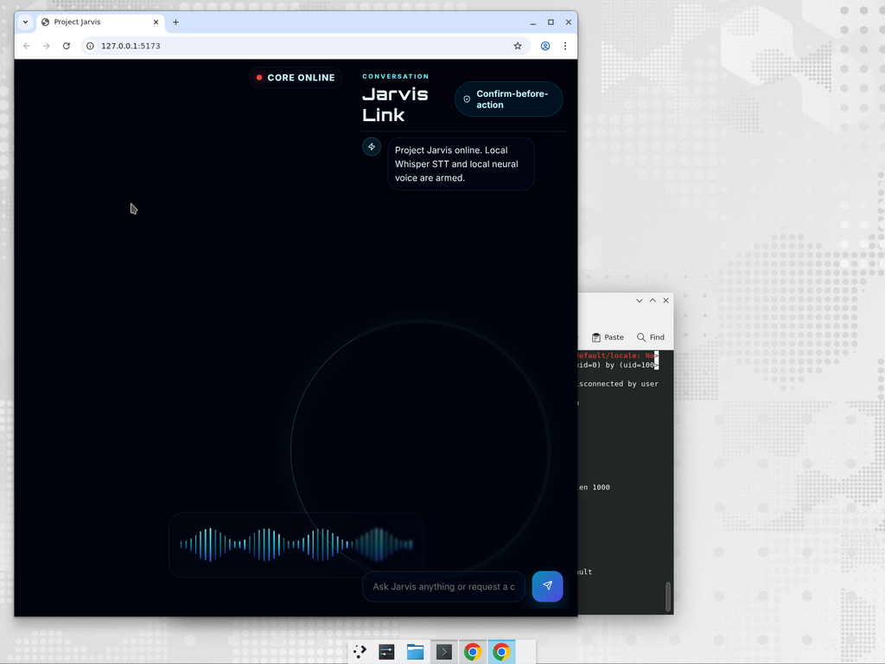

# Project Jarvis



Project Jarvis is a modular AI assistant built as a real desktop application: an Electron + React HUD connected to a local Python FastAPI AI engine. It can chat, listen, speak, remember context, and execute browser/system actions only after explicit user confirmation.

## Highlights

- **Desktop app, not just a website** — `npm run start` launches a separate Electron window.
- **Local backend engine** — FastAPI REST/WebSocket service powers voice, memory, LLM, and actions.
- **NVIDIA LLM by default** — OpenAI-compatible NVIDIA endpoint with OpenAI/Gemini provider-ready config.
- **Local voice pipeline** — Faster-Whisper STT for input and VoxCPM2 voice-design TTS for output.
- **Voice profiles** — thick female Jarvis voice by default and thick male voice selectable in config.
- **Safety Gate** — all risky actions require approval before execution.
- **Browser automation** — Chrome and Edge remote-debugging support with CDP fallback.
- **WhatsApp automation** — contact, phone-number, and current-open-chat flows; ambiguous contact matches trigger clarification instead of guessing.
- **Modern HUD UI** — dark Jarvis interface with HUD art, waveform, chat, state indicators, and action confirmations.

## Repository layout

```text
JARVIS/
├── README.md
├── SETUP_GUIDE.md
├── DELIVERY_REPORT.md
├── docs/
│   ├── images/
│   │   └── jarvis-desktop-hud.png
│   └── guides/
├── jarvis-backend/
│   ├── README.md
│   ├── config.yaml
│   ├── requirements.txt
│   ├── pyproject.toml
│   ├── src/jarvis_backend/
│   │   ├── actions/      # Browser/system executors + confirmation-safe action handling
│   │   ├── audio/        # Microphone, playback, VAD, voice pipeline
│   │   ├── llm/          # NVIDIA/OpenAI/Gemini-compatible client + action parser
│   │   ├── memory/       # SQLite conversation history
│   │   ├── server/       # FastAPI app and WebSocket endpoints
│   │   ├── state/        # Pydantic state/action models
│   │   ├── stt/          # Faster-Whisper STT
│   │   └── tts/          # VoxCPM/Piper/Coqui TTS adapters
│   └── tests/
└── jarvis-frontend/
    ├── README.md
    ├── package.json
    ├── electron/         # Electron main/preload process
    └── src/
        ├── assets/       # HUD artwork
        ├── lib/          # REST/WebSocket API client + types
        ├── styles/       # Futuristic HUD CSS
        ├── App.tsx
        └── main.tsx
```

## Architecture

```text
Electron Desktop HUD
  ├─ Chat + browser mic capture
  ├─ Browser speech fallback
  ├─ WebSocket state/action updates
  └─ REST calls for direct chat/voice replies

FastAPI AI Engine
  ├─ JarvisAgent orchestration
  ├─ ConversationMemory (SQLite)
  ├─ NVIDIA/OpenAI/Gemini-compatible LLM config
  ├─ ActionParser → ActionManager → Safety Gate
  ├─ BrowserActionExecutor (Chrome/Edge CDP + Selenium)
  ├─ SystemActionExecutor (allowlisted apps/commands)
  ├─ Faster-Whisper STT
  ├─ VoxCPM2 TTS voice design
  └─ Piper/Coqui fallback TTS adapters
```

## Quick start

### 1. Backend

```bash
cd jarvis-backend
python -m venv .venv
source .venv/bin/activate
pip install -r requirements.txt
export NVIDIA_API_KEY="your-nvidia-api-key"
PYTHONPATH=src python -m jarvis_backend --config config.yaml
```

Backend default: `http://127.0.0.1:8765`

Health check:

```bash
curl http://127.0.0.1:8765/health
```

### 2. Chrome / Edge automation

Jarvis controls your existing browser session through remote debugging.

Chrome:

```bash
google-chrome --remote-debugging-port=9222 --user-data-dir="$HOME/jarvis-chrome-profile"
```

Microsoft Edge:

```bash
microsoft-edge --remote-debugging-port=9223 --user-data-dir="$HOME/jarvis-edge-profile"
```

### 3. Desktop app

```bash
cd jarvis-frontend
npm install
npm run start
```

This starts Vite and opens the Electron desktop app window.

## Configuration

Main config: `jarvis-backend/config.yaml`

Important values:

- `llm.provider`: `nvidia` by default; switchable to `openai` or `gemini` later.
- `llm.api_key_env`: `NVIDIA_API_KEY`.
- `stt.engine`: `faster_whisper`. VoxCPM is TTS/voice-generation, not official STT.
- `tts.engine`: `voxcpm` by default.
- `tts.voice_profile`: `female_thick` by default; set `male_thick` for male voice.
- `actions.require_confirmation`: `true`.
- `actions.browser_debugger_addresses`: ordered Chrome/Edge endpoints.

## VoxCPM voice setup

```yaml
tts:
  engine: "voxcpm"
  voxcpm_model: "openbmb/VoxCPM2"
  voice_profile: "female_thick"
  voice_profiles:
    female_thick: "A confident adult woman with a deeper, thicker, warm contralto voice, calm Jarvis assistant tone, clear articulation, cinematic presence"
    male_thick: "A confident adult man with a deep, thick, warm baritone voice, calm Jarvis assistant tone, clear articulation, cinematic presence"
```

Switch to male:

```yaml
tts:
  voice_profile: "male_thick"
```

## Action examples

All of these require approval in the GUI Safety Gate before execution.

| User asks | Structured action | Behavior |
|---|---|---|
| `open YouTube in my browser` | `open_website` / `youtube_control` | Opens YouTube in Chrome/Edge |
| `search YouTube for Interstellar theme` | `youtube_control` with `search` | Opens YouTube search results |
| `search Google for latest AI news` | `google_search` | Opens Google results |
| `message U Karthik on WhatsApp saying hi` | `whatsapp_message` contact flow | Searches contact and sends after approval |
| `message +15551234567 on WhatsApp saying hi` | `whatsapp_message` phone flow | Opens `wa.me` prepared message |
| `send hi on WhatsApp` with a chat open | `whatsapp_message` current-chat flow | Sends to currently open chat |

If WhatsApp search shows multiple possible matches, Jarvis returns the visible options and asks which one to use instead of guessing.

## Validation

Backend:

```bash
cd jarvis-backend
python -m compileall src tests
PYTHONPATH=src python -m pytest
```

Frontend:

```bash
cd jarvis-frontend
npm run build
```

## Safety model

Jarvis does not execute raw LLM text. The action path is:

```text
LLM structured JSON → Pydantic validation → GUI Safety Gate → user approval → allowlisted executor
```

Protected actions include app control, website opens, searches, browser automation, WhatsApp messaging, and system commands.

## Documentation

- [Setup Guide](SETUP_GUIDE.md)
- [Delivery Report](DELIVERY_REPORT.md)
- [Backend README](jarvis-backend/README.md)
- [Frontend README](jarvis-frontend/README.md)
